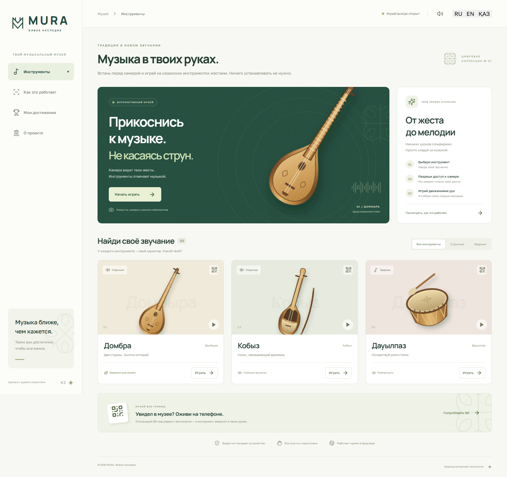
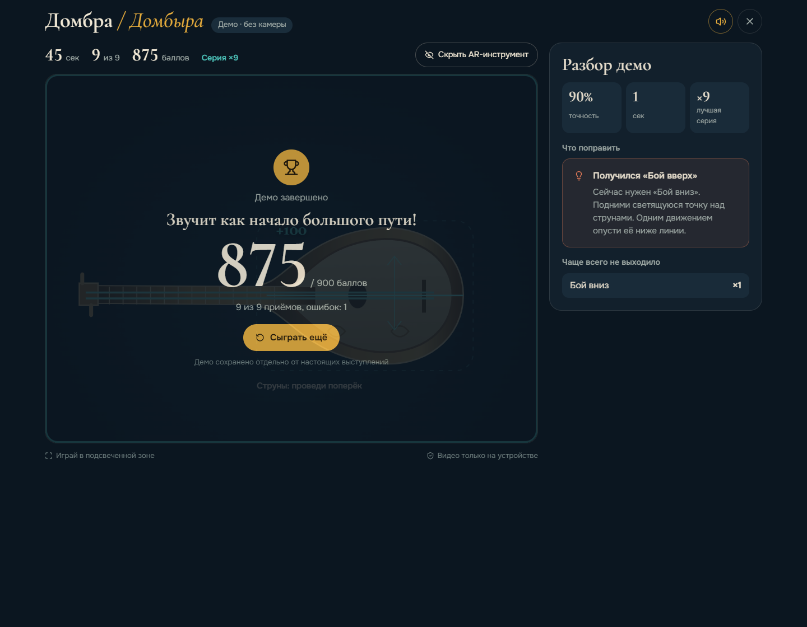

# MURA — музыка в твоих руках

Интерактивный музей казахских музыкальных инструментов: встань перед веб-камерой и играй на **домбре, кобызе или дауылпазе** движениями руки. Распознавание, синтез звука и AR работают прямо в браузере, ничего устанавливать не нужно.

Кейс ADMIT Hackathon «Motion: камера вместо джойстика», свободный вариант — **музыкальный инструмент в воздухе**.

> ### ▶ Живая версия: ЗАПОЛНИТЬ ССЫЛКУ

| | |
|---|---|
|  |  |

---

## Проверка за две минуты

1. Откройте деплой (или `npm ci && npm run dev` → http://localhost:5173).
2. Выберите инструмент.
3. **Без камеры:** «Попробовать демо без камеры» — приёмы, счёт и разбор работают.
   **С камерой:** совместите точку на кисти с меткой и задержите на секунду — выступление начнётся само.
4. Ошибитесь — подсказка скажет, что именно исправить, а на видео появится метка со стрелкой.
5. После 9 приёмов или 45 секунд — разбор: точность, лучшая серия, частые ошибки. Рекорды — во вкладке «Мои достижения».
6. Языки в шапке: **RU / EN / ҚАЗ**.

Прямые ссылки: `/?instrument=dombyra`, `/?instrument=kobyz`, `/?instrument=dauylpaz`. QR-код каждого экспоната скачивается из приложения для печати.

> Камера доступна только по HTTPS или на `localhost`, поэтому с телефона открывайте деплой, а не локальный IP.

---

## Твист: режим «Ошибка»

Вместо «движение не распознано» система говорит, **где** рука и **что сделать**:

| Что увидела система | Что советует |
|---|---|
| Рука слишком слева | Сдвинь кисть вправо, к струнам |
| Пальцы соединились | Разомкни большой и указательный — отпусти струну |
| Сейчас нужен край | Сдвинь кисть к метке сбоку, затем ударь вниз |

Правила — [`src/lib/gestures.ts`](src/lib/gestures.ts), показ подсказок без мерцания — [`src/lib/coaching.ts`](src/lib/coaching.ts). Ожидаемый приём влияет только на текст подсказки, не на классификацию движения.

## Распознавание

MediaPipe даёт 21 точку кисти. Всё остальное написано для этого проекта: анализ траектории центра костяшек и расстояния между большим и указательным пальцами.

| Инструмент | Приёмы | Как распознаётся |
|---|---|---|
| Домбра | бой вниз, бой вверх, щипок | пересечение линии струн с амплитудой; щипок — полный цикл «сблизил — разомкнул» |
| Кобыз | смычок вправо/влево, короткий штрих | горизонтальные сегменты, порог адаптируется к размеру кисти |
| Дауылпаз | центр, край, двойной удар | пересечение мембраны отрезком между кадрами — быстрый удар не теряется; двойной — второй удар до 500 мс |

Защита от ложных нот: автокалибровка размера кисти и дрожания, гистерезис, подтверждение резких скачков, восстановление коротких разрывов трекинга, выбор «своей» руки при двух в кадре.

Счёт: нужный приём `+100`, другой `−25`, максимум 900.

## Что ещё

- **AR поверх видео** — инструмент, смычок и колотушка следуют за рукой ([`ARInstrument.tsx`](src/components/ARInstrument.tsx)).
- **Звук синтезирован** в Web Audio (Карплус—Стронг, смычковый и ударный синтез), ни одного аудиофайла.
- **Приватность** — видео никуда не уходит, модель и WASM раздаются с самого сайта.
- **Мобильные** — адаптивная сцена, Wake Lock, облегчённый режим и автооткат GPU → CPU на слабых устройствах.
- Рекорды и история — локально в браузере.

**Стек:** React 19, TypeScript, Vite, MediaPipe Tasks Vision, Web Audio API. Деплой — Cloudflare Pages (`public/_headers`, `public/_redirects`).

## Запуск и тесты

```sh
npm ci
npm run dev       # http://localhost:5173
npm run build     # проверка типов + сборка в dist/
npm test          # 44 юнит-теста распознавания и аудио
npm run test:e2e  # браузерные сценарии (Playwright, нужен Chromium: npx playwright install chromium или CHROME_PATH)
```

На реальном железе: `node scripts/check-real-camera.mjs`, `node scripts/check-audio.mjs`.

## Ограничения

- Имитация техники одной рукой, а не оценка мастерства: вторая рука и аппликатура не распознаются.
- AR — 2D-наложение, а не WebXR.
- Звук — цифровая интерпретация, не записи оригиналов.
- Слабый свет, низкий FPS и перекрытие пальцев ухудшают распознавание.

## Сроки и источники

Проект начат после старта хакатона: первый коммит — 28.09.2026, 20:12.

- [MediaPipe Hand Landmarker](https://ai.google.dev/edge/mediapipe/solutions/vision/hand_landmarker/web_js) ([Apache 2.0](https://github.com/google-ai-edge/mediapipe/blob/master/LICENSE))
- Техника домбры: [UNESCO — Dombra Kuy](https://ich.unesco.org/en/RL/kazakh-traditional-art-of-dombra-kuy-00996), [Smithsonian Folkways — Ilme](https://folkways.si.edu/aygul-ulkenbaeva/ilme/central-asia-islamica-world/music/track/smithsonian)

Иллюстрации нарисованы для проекта. Сторонние компоненты — [`THIRD_PARTY_NOTICES.md`](THIRD_PARTY_NOTICES.md).
